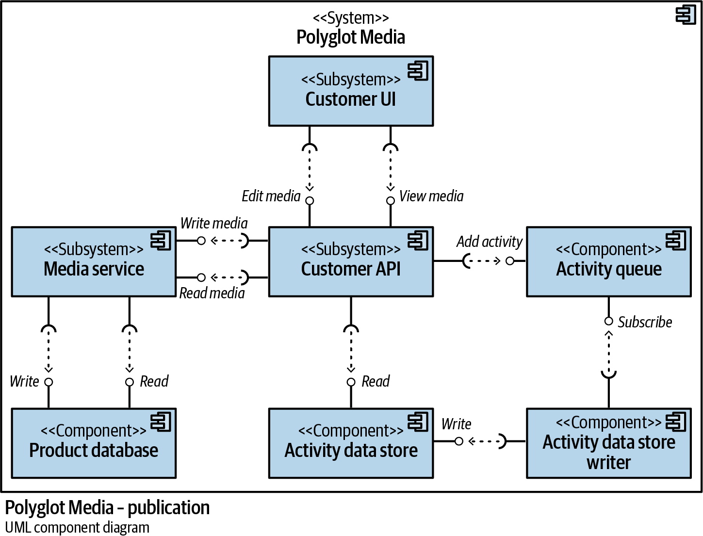
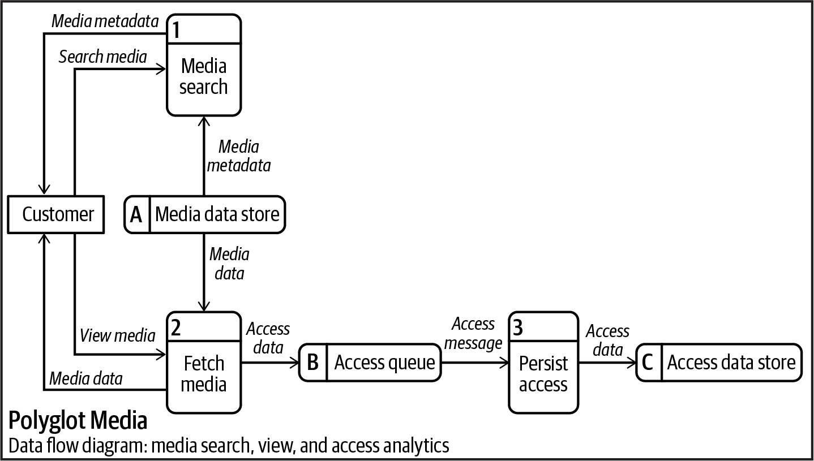
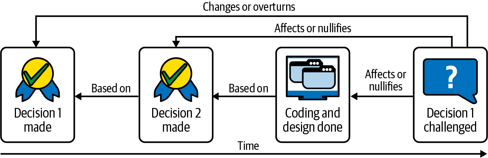
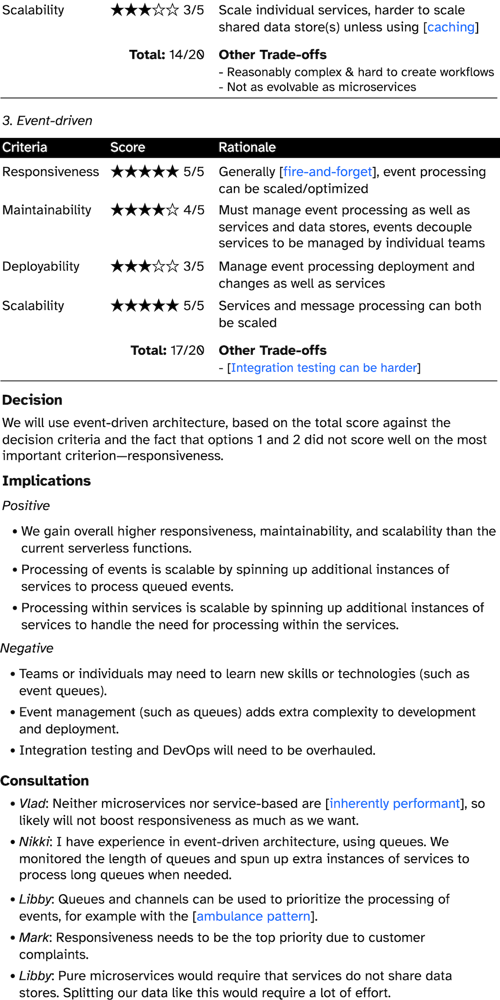

# Figures
[> Home](README.md)

All images are licensed as [CC BY 4.0 (Jacqui Read / jacquiread.com)](https://creativecommons.org/licenses/by/4.0/)

## Contents
### Part I
- <a href="#chap01">Chapter 1</a>
- <a href="#chap02">Chapter 2</a>
- <a href="#chap03">Chapter 3</a>
- <a href="#chap04">Chapter 4</a>
- <a href="#chap05">Chapter 5</a>
- <a href="#chap06">Chapter 6</a>

### Part II
- <a href="#chap07">Chapter 7</a>
- <a href="#chap08">Chapter 8</a>
- <a href="#chap09">Chapter 9</a>

### Part III
- <a href="#chap10">Chapter 10</a>
- <a href="#chap11">Chapter 11</a>
- <a href="#chap12">Chapter 12</a>

### Part IV
- <a href="#chap13">Chapter 13</a>
- <a href="#chap14">Chapter 14</a>
- <a href="#chap15">Chapter 15</a>

## Chapter 1

### Fig 1-1

### Fig 1-2

### Fig 1-3

### Fig 1-4

### Fig 1-5

### Fig 1-6

### Fig 1-7

### Fig 1-8

### Fig 1-9

### Fig 1-10

### Fig 1-11

### Fig 1-12

<a href="#toc">^ contents</a>

## Chapter 2
### Fig 2-1

### Fig 2-2

### Fig 2-3

### Fig 2-4

### Fig 2-5

### Fig 2-6

### Fig 2-7

### Fig 2-8

<a href="#toc">^ contents</a>

## Chapter 3
### Fig 3-1

### Fig 3-2

### Fig 3-3

### Fig 3-4

### Fig 3-5

### Fig 3-6

### Fig 3-7

### Fig 3-8

<a href="#toc">^ contents</a>

## Chapter 4
### Fig 4-1

### Fig 4-2

### Fig 4-3

### Fig 4-4

### Fig 4-5

### Fig 4-6

### Fig 4-7

### Fig 4-8

### Fig 4-9

<a href="#toc">^ contents</a>

## Chapter 5
### Fig 5-1

### Fig 5-2

### Fig 5-3

### Fig 5-4

### Fig 5-5

### Fig 5-6

### Fig 5-7

### Fig 5-8

### Fig 5-9

<a href="#toc">^ contents</a>

## Chapter 6
### Fig 6-1

### Fig 6-2

### Fig 6-3

### Fig 6-4

### Fig 6-5

### Fig 6-6

### Fig 6-7

### Fig 6-8

### Fig 6-9

### Fig 6-10

### Fig 6-11

### Fig 6-12

### Fig 6-13

### Fig 6-14

### Fig 6-15

### Fig 6-16

### Fig 6-17

<a href="#toc">^ contents</a>

## Chapter 7
### Fig 7-1

<a href="#toc">^ contents</a>

## Chapter 8
### Fig 8-1

### Fig 8-2

<a href="#toc">^ contents</a>

## Chapter 9
### Fig 9-1

<a href="#toc">^ contents</a>

## Chapter 10
### Fig 10-1

### Fig 10-2

### Fig 10-3

### Fig 10-4

### Fig 10-5

<a href="#toc">^ contents</a>

## Chapter 11
### Fig 11-1

### Fig 11-2

<a href="#toc">^ contents</a>

## Chapter 12
### Fig 12-1

### Fig 12-2

### Fig 12-3
[🔍 view text version](/assets/ADR-example-decision-making.md)

### Fig 12-4
[🔍 view text version](/assets/ADR-example-decision-making.md)

### Fig 12-5
[🔍 view text version](/assets/ADR-example.md)

### Fig 12-6

### Fig 12-7

<a href="#toc">^ contents</a>

## Chapter 13
### Fig 13-1

### Fig 13-2

<a href="#toc">^ contents</a>

## Chapter 14
### Fig 14-1

<a href="#toc">^ contents</a>

## Chapter 15
### Fig 15-1

### Fig 15-2

### Fig 15-3

### Fig 15-4

<a href="#toc">^ contents</a>

[> Home](README.md)